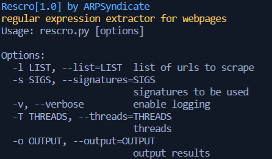

# Rescro | Regular Expression Extractor for Webpages

## Screenshots

## Instructions for running
1. Install requirements using `pip3 install -U -r requirements.txt`.
2. Run `python3 rescro.py`. 

**COMPATIBILITY TESTED ON ARCHLINUX(x64) & DEBIAN(x64) ONLY** 
**FEEL FREE TO SUBMIT PULL REQUESTS**
